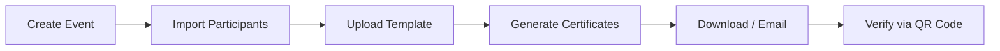

 
# 🎓 CertifyPro

### Smart Bulk Certificate Generation & Verification System

<p align="center">
  
  
  
  
  
</p>

<p align="center">
  <strong>A modern, high‑performance Django platform for generating, managing, distributing, and verifying certificates at scale.</strong>
</p>

<p align="center">
  
</p>

---

<!-- ===== INTERACTIVE TOC START ===== -->
<div id="table-of-contents">

<details>
  <summary><strong>📖 Table of Contents (Click to expand)</strong></summary>
  <br>

| Section | Section |
|---------|---------|
| 👉 [✨ Features](#-features) | 👉 [🚀 Getting Started](#-getting-started) |
| 👉 [🖼️ Screenshots](#️-screenshots) | 👉 [⚙️ Technology Stack](#️-technology-stack) |
| 👉 [🎥 Live Demo](#-live-demo) | 👉 [📁 Project Structure](#-project-structure) |
| 👉 [🔄 Workflow](#-workflow) | 👉 [🔒 Production Setup](#-production-setup) |
| 👉 [🗺️ Roadmap](#️-roadmap) | 👉 [📈 Why CertifyPro?](#-why-certifypro) |
| 👉 [👨‍💻 Author](#-author) | 👉 [🤝 Contributing](#-contributing) |
| 👉 [📄 License](#-license) | 👉 [📞 Support](#-support) |

</details>

</div>
<!-- ===== INTERACTIVE TOC END ===== -->

<!-- Add this small Back-to-Top button at the end of every section -->
<!-- Example: Paste this right after your "## ✨ Features" heading -->
 
---

## ✨ Features

### Core Capabilities

| Feature                         | Description                                                                 |
| ------------------------------- | --------------------------------------------------------------------------- |
| 📄 **Bulk Generation**          | Generate hundreds/thousands of certificates from CSV/Excel in seconds       |
| 🎨 **Custom Templates**         | Upload PNG/JPG backgrounds and define field positions with pixel precision  |
| 🆔 **Unique IDs**               | Auto‑generate IDs like `CERT-2026-0001` for each certificate                |
| 📱 **QR Code Verification**     | Each certificate includes a QR code linking to a public verification page   |
| ✉️ **Email Automation**         | Send certificates individually or in bulk with tracking                     |
| 📦 **ZIP Export**               | Download all certificates for an event as a single ZIP archive              |
| 🔍 **Public Verification Portal** | Anyone can verify authenticity by ID or QR scan                           |
| 📊 **Analytics Dashboard**      | Track generation counts, email delivery rates, and event statistics         |

---

## 🖼️ Screenshots

### 📊 Dashboard  
*Centralised overview of all events, participants, and recent activity.*  


### ⚡ Certificate Generation  
*One‑click bulk generation with event and template selection.*  


### 🔍 Verification Portal  
*Public‑facing page for instant certificate validation.*  


---

## 🔄 Workflow



*(If Mermaid isn't supported, here's a text view)*

```
Create Event → Import Participants → Upload Template → Generate Certificates → Download / Email → Verify via QR Code
```

---

## 🚀 Getting Started

### Prerequisites

- Python 3.10 or higher
- `pip` package manager
- (Optional) Docker & Docker Compose

---

### Local Installation

```bash
# 1. Clone the repository
git clone https://github.com/mhd-humraz/certifypro.git
cd certifypro

# 2. Run the automated setup script (creates virtual environment, installs dependencies, migrates DB, creates admin)
bash setup.sh

# 3. Activate the virtual environment
source venv/bin/activate

# 4. Start the development server
python manage.py runserver
```

Once running, open `http://localhost:8000` in your browser.

> **Default admin credentials:**  
> Username: `admin`  
> Password: `admin123`

---

### Docker Deployment

For production‑like testing or quick deployment:

```bash
docker-compose up --build
```

Then visit `http://localhost` – the application will be served with Gunicorn and Nginx (if configured).

---

## ⚙️ Technology Stack

| Layer            | Technology                         |
| ---------------- | ---------------------------------- |
| **Backend**      | Django 4.2 (Python 3.10+)          |
| **Database**     | SQLite (development) / PostgreSQL  |
| **PDF Generation** | Pillow + ReportLab                |
| **QR Codes**     | `qrcode` library                   |
| **Excel/CSV**    | `openpyxl`                         |
| **Frontend**     | Bootstrap 5 + Bootstrap Icons      |
| **Deployment**   | Docker, Gunicorn, Nginx            |

---

## 📁 Project Structure

```text
certifypro/
├── certifypro/                 # Django project settings and URL config
│   ├── settings.py
│   └── urls.py
├── certificates/               # Main application
│   ├── models.py               # Event, Participant, Template, Certificate
│   ├── views.py                # All business logic
│   ├── forms.py                # Django forms
│   ├── utils.py                # Certificate generation (Pillow + ReportLab)
│   └── urls.py                 # App‑specific routes
├── templates/                  # HTML templates (base, auth, app views)
├── static/                     # Custom CSS/JS (Bootstrap is CDN‑served)
├── media/                      # Uploaded templates and generated certificates
├── sample_participants.csv     # Example CSV for import
├── requirements.txt            # Python dependencies
├── setup.sh                    # Automated setup script
├── Dockerfile
├── docker-compose.yml
└── README.md                   # You are here 📖
```

---

## 🔒 Production Setup

Before deploying to production, make sure to apply the following changes in `settings.py`:

### Security

```python
DEBUG = False
ALLOWED_HOSTS = ['your-domain.com', 'www.your-domain.com']
SECRET_KEY = 'your-secure-random-secret-key'
```

### Email (SMTP)

```python
EMAIL_BACKEND = 'django.core.mail.backends.smtp.EmailBackend'
EMAIL_HOST = 'smtp.gmail.com'
EMAIL_PORT = 587
EMAIL_USE_TLS = True
EMAIL_HOST_USER = 'your@email.com'
EMAIL_HOST_PASSWORD = 'your-app-password'
DEFAULT_FROM_EMAIL = 'your@email.com'
```

### Database

For production, switch from SQLite to PostgreSQL:

```python
DATABASES = {
    'default': {
        'ENGINE': 'django.db.backends.postgresql',
        'NAME': 'certifypro_db',
        'USER': 'certifypro_user',
        'PASSWORD': 'secure-password',
        'HOST': 'localhost',
        'PORT': '5432',
    }
}
```

### Static & Media Files

```python
STATIC_ROOT = '/var/www/certifypro/static/'
MEDIA_ROOT = '/var/www/certifypro/media/'
```

---

## 🗺️ Roadmap

### Version 2.0 (Planned)

- [ ] **Drag & Drop Certificate Designer** – visual layout creation
- [ ] **WhatsApp Certificate Delivery** – send certificates via WhatsApp
- [ ] **Digital Signatures** – cryptographic signing of PDFs
- [ ] **Multi‑Organization Support** – manage multiple tenants
- [ ] **Certificate Expiry Management** – set and track validity periods
- [ ] **Public REST API** – integrate with third‑party systems

### Version 3.0 (Vision)

- [ ] **AI‑Powered Designer** – intelligent layout suggestions
- [ ] **Canva Integration** – seamless design imports
- [ ] **Blockchain Verification** – immutable certificate records
- [ ] **Advanced Analytics Dashboard** – deep insights and reporting
- [ ] **White‑Label Solutions** – custom branding for organisations
- [ ] **Enterprise SSO** – single sign‑on (OAuth, SAML)

---

## 📈 Why CertifyPro?

- 🚀 **Lightning‑fast** – generate 1,000+ certificates in under a minute
- 🔐 **Tamper‑proof** – QR‑based public verification ensures authenticity
- 📦 **Batch import** – bulk participants via CSV/XLSX
- 🎨 **Fully customisable** – pixel‑perfect template control
- ✉️ **Automated delivery** – email with tracking and attachments
- 📂 **Easy export** – ZIP archive for complete events
- 🐳 **Docker‑ready** – production‑grade deployment out‑of‑the‑box
- 💡 **Open Source** – free to use, modify, and distribute under MIT

---

## 👨‍💻 Author

**Muhammed Humraz H**  
BCA Student · Flutter Developer · Community Builder · AI Enthusiast

<p>
  <a href="https://github.com/mhd-humraz">
    
  </a>
  <a href="https://linkedin.com/in/muhammed-humraz-283a5435b">
    
  </a>
</p>

---

## 🤝 Contributing

Contributions are **welcome and appreciated**!

1. Fork the repository  
2. Create a feature branch:  
   ```bash
   git checkout -b feature/amazing-feature
   ```  
3. Commit your changes:  
   ```bash
   git commit -m "Add amazing feature"
   ```  
4. Push to the branch:  
   ```bash
   git push origin feature/amazing-feature
   ```  
5. Open a Pull Request with a clear description of your changes.

### Development Guidelines

- Follow PEP 8 for Python code.
- Write meaningful commit messages.
- Update documentation accordingly.
- Test thoroughly before submitting.

---

## 📄 License

This project is licensed under the **MIT License** – see the [LICENSE](LICENSE) file for full details.

---

## 📞 Support

- **Issues**: [GitHub Issues](https://github.com/mhd-humraz/certifypro/issues)  
- **Discussions**: [GitHub Discussions](https://github.com/mhd-humraz/certifypro/discussions)  
- **Email**: your@email.com

---

<p align="center">
  ⭐ <strong>If CertifyPro helped you, please give it a star on GitHub!</strong> ⭐
</p>

<p align="center">
  Made with ❤️ by <a href="https://github.com/mhd-humraz">Muhammed Humraz H</a>
</p>
 

 <p align="center">
  
</p>

<!-- Animated pulse effect using SVG -->
<p align="center">
  <svg width="200" height="40" xmlns="http://www.w3.org/2000/svg">
    <rect x="0" y="0" width="200" height="40" fill="#28a745" rx="20">
      <animate attributeName="opacity" values="0.7;1;0.7" dur="2s" repeatCount="indefinite" />
    </rect>
    <text x="100" y="26" font-family="Arial" font-size="18" fill="white" text-anchor="middle" font-weight="bold">✅ VERIFIED</text>
  </svg>
</p>


 
 
